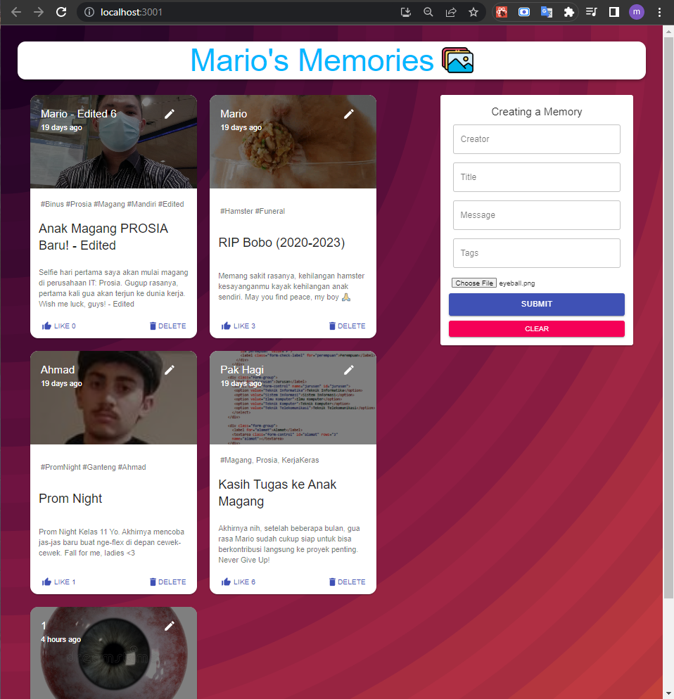
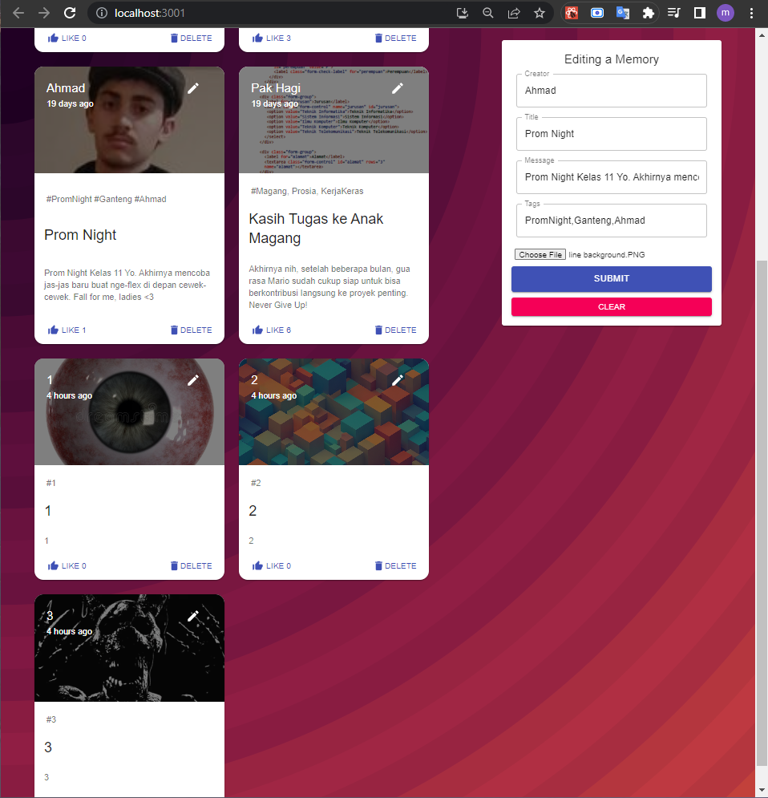
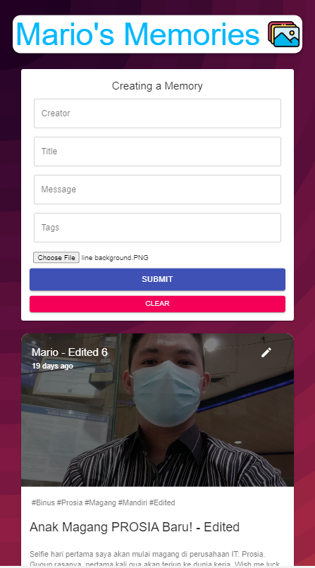

# Social Media - Memories (part 2)

A mini social media project where I first practiced implementing CRUD Operations using MongoDB Atlas, in other words, MERN stack. Right now, the 2nd part of the video tutorial into making this is finished, where I have completed the CRUD actions and other features like mobile responsiveness and the "like" feature.

Project made by Mario (with some of my own code modifications).

---

Some screenshots:

---

The tutorial video can be found [here](https://www.youtube.com/playlist?list=PL6QREj8te1P7VSwhrMf3D3Xt4V6_SRkhu).

